# Homelab Infrastructure Technical Manual

> **Comprehensive Documentation for the Hermes Homelab & Azure Hybrid Environment**
>
> Version 1.0 | January 7, 2026

---

## Prologue: The Story Behind This Manual

### It Started With Sophia's Photos

In 2023, two things happened almost simultaneously. I traveled to Japan—exploring temples in Kyoto, watching the sun set over Mount Fuji, wandering through the neon-lit streets of Tokyo. I captured hundreds of photos and videos, moments I wanted to keep forever.

Around the same time, my daughter Sophia was growing up fast. Her first steps, her laughter, her tiny milestones—I was capturing everything. These weren't just files. They were irreplaceable memories.

Then Google Photos delivered the notification I'd been dreading: *"You've run out of storage. Upgrade to continue backing up your memories."*

That notification changed everything.

I did the math. If I kept paying monthly just to store my own memories, I would eventually spend enough to buy a NAS outright—and I would gain something the cloud could never give me: **real privacy and full control over my data**. My Japan trip photos, Sophia's milestones—these deserved to exist somewhere I truly owned.

So I bought a Synology NAS. Just to store photos. Just to save money.

*I had no idea what I was about to unleash.*

---

### The Escalation Trap

The NAS arrived, and within days it was running perfectly. Sophia's photos were safe, organized, and accessible from anywhere in our home. Mission accomplished.

But then I remembered an unused Raspberry Pi sitting in a drawer. *"What if I set up Pi-hole to block ads?"* One weekend project later, my entire household had cleaner, faster internet. Something in my brain flipped—once you optimize one part of your setup, your mind immediately starts looking for the next thing to improve.

With 10 TB of storage available, the next idea came naturally: *Why not self-host my media and stop paying for streaming subscriptions?* The state of streaming made the decision easy—shows vanishing without warning, prices increasing, content scattered across a dozen apps. I wanted a single place to organize the media I already owned.

That was the moment the homelab truly began.

A mini PC became a Docker host. Docker became Proxmox. One node became a cluster. The cluster needed proper networking. Proper networking needed VLANs. VLANs needed enterprise-grade switches. Enterprise switches needed a proper firewall. The firewall needed observability. Observability needed Prometheus. Prometheus needed Grafana. Grafana needed custom dashboards. Custom dashboards needed APIs. APIs needed CI/CD pipelines. Pipelines needed GitLab. GitLab needed... well, you get the idea.

The escalation never stopped.

---

### From Photo Storage to Hybrid Cloud

Around this same time, Microsoft announced layoffs. I wasn't afraid of losing my job—I trusted my skills—but I was terrified of losing access to the technologies I worked with every day. All the tools, platforms, and cloud environments I relied on could disappear overnight if I no longer worked there.

So the motivation behind this homelab doubled. It was no longer only about storing Sophia's photos. It became a way to **preserve my technical playground**—a space where I could learn, break things, rebuild them, and stay sharp without relying on any employer.

Today, what started as a simple NAS has become:

- **A 2-node Proxmox cluster** running 22+ virtual machines and containers
- **A 9-node Kubernetes cluster** for container orchestration
- **An enterprise-grade TP-Link Omada network** with 8 VLANs and full SDN control
- **30+ Docker services** for media, monitoring, automation, and experimentation
- **A hybrid cloud environment** with Azure Active Directory and site-to-site VPN
- **A complete observability stack** with distributed tracing, custom APIs, and real-time dashboards

From trip photos to full-blown infrastructure. From $3/month Google storage to a miniature enterprise running inside my house.

---

### Why This Manual Exists

This technical manual is more than documentation. It's the culmination of hundreds of hours of learning, countless mistakes, and the satisfaction of building something truly mine.

Every diagram in these pages represents a problem I solved. Every configuration block represents a lesson I learned. Every service listed represents a decision I made—sometimes brilliant, sometimes disastrous, always educational.

If you're reading this, you might be:
- **A future version of me**, trying to remember why I configured something a certain way
- **A colleague or friend**, curious about what I've been building in my spare time
- **A fellow homelabber**, looking for ideas or validation that the obsession is worth it
- **A potential employer**, wondering what kind of engineer documents their hobby projects at enterprise scale

Whoever you are, welcome to the ecosystem.

---

### This Is My Passion. This Makes Me Happy.

Some people collect stamps. Some people restore cars. Some people tend gardens.

I build infrastructure.

There's a particular joy in watching a perfectly orchestrated deployment cascade through Ansible playbooks. There's satisfaction in seeing all green checkmarks on an Uptime Kuma dashboard. There's pride in solving a problem at 2 AM that no one else will ever know about.

This homelab started because I wanted to protect Sophia's photos. It grew because I refused to let a layoff scare me away from the technologies I love. It evolved because every solved problem revealed three more interesting ones.

Today, it's not just a project. It's not just a lab. It's not even just an ecosystem.

**It's proof that passion, applied consistently, creates extraordinary things.**

Every cable I've crimped, every YAML file I've debugged, every 3 AM troubleshooting session—all of it has made me a better engineer, a more resilient problem-solver, and honestly, a happier person.

Sophia's photos are still safe on that original NAS. But now they're backed up to Azure, replicated across nodes, monitored by custom dashboards, and protected by enterprise-grade security.

They're not just stored anymore.

*They're loved.*

---

**Welcome to the Hermes Homelab.**

Version 2 is complete. Version 3 is forming in my head. Somewhere beyond that, version 10 is waiting.

The journey is just getting started.

---

## Table of Contents

1. [Executive Summary](#1-executive-summary)
2. [Network Infrastructure](#2-network-infrastructure)
   - 2.1 [Physical Network Topology](#21-physical-network-topology)
   - 2.2 [Omada Ecosystem](#22-omada-ecosystem)
   - 2.3 [VLAN Architecture](#23-vlan-architecture)
   - 2.4 [SSID Configuration](#24-ssid-configuration)
   - 2.5 [Switch Port Configuration](#25-switch-port-configuration)
   - 2.6 [DNS Configuration](#26-dns-configuration)
   - 2.7 [Remote Access (Tailscale)](#27-remote-access-tailscale)
3. [Compute Infrastructure](#3-compute-infrastructure)
   - 3.1 [Proxmox Cluster Overview](#31-proxmox-cluster-overview)
   - 3.2 [Node Specifications](#32-node-specifications)
   - 3.3 [Cluster Configuration](#33-cluster-configuration)
   - 3.4 [VM Templates](#34-vm-templates)
4. [Storage Infrastructure](#4-storage-infrastructure)
   - 4.1 [Synology NAS Configuration](#41-synology-nas-configuration)
   - 4.2 [NFS Shares](#42-nfs-shares)
   - 4.3 [Storage Architecture](#43-storage-architecture)
5. [Docker Services](#5-docker-services)
   - 5.1 [docker-vm-core-utilities01](#51-docker-vm-core-utilities01)
   - 5.2 [docker-lxc-media](#52-docker-lxc-media)
   - 5.3 [Service Templates](#53-service-templates)
6. [Infrastructure as Code](#6-infrastructure-as-code)
   - 6.1 [Terraform Overview](#61-terraform-overview)
   - 6.2 [Ansible Automation](#62-ansible-automation)
   - 6.3 [Deployment Workflows](#63-deployment-workflows)
7. [Azure Hybrid Environment](#7-azure-hybrid-environment)
   - 7.1 [Architecture Overview](#71-architecture-overview)
   - 7.2 [Active Directory Deployment](#72-active-directory-deployment)
   - 7.3 [Enterprise Tiering Model](#73-enterprise-tiering-model)
8. [Observability Stack](#8-observability-stack)
   - 8.1 [Glance Dashboard](#81-glance-dashboard)
   - 8.2 [Prometheus & Grafana](#82-prometheus--grafana)
   - 8.3 [Custom APIs](#83-custom-apis)
9. [Security Architecture](#9-security-architecture)
   - 9.1 [Authentik SSO](#91-authentik-sso)
   - 9.2 [Forward Authentication](#92-forward-authentication)
   - 9.3 [SSL/TLS Configuration](#93-ssltls-configuration)
10. [Backup & Disaster Recovery](#10-backup--disaster-recovery)
    - 10.1 [Backup Strategy](#101-backup-strategy)
    - 10.2 [Disaster Recovery Procedures](#102-disaster-recovery-procedures)
11. [Future Enhancements](#11-future-enhancements)
12. [Appendix](#12-appendix)

---

## 1. Executive Summary

This technical manual documents a comprehensive homelab infrastructure featuring:

- **2-node Proxmox cluster** with 22+ VMs and LXC containers
- **9-node Kubernetes cluster** for container orchestration
- **TP-Link Omada SDN** for enterprise-grade networking
- **30+ Docker services** for media, monitoring, and automation
- **Azure hybrid environment** with Active Directory
- **Full observability stack** with distributed tracing

### Infrastructure at a Glance

```
╔══════════════════════════════════════════════════════════════════════════════╗
║                        INFRASTRUCTURE SUMMARY                                 ║
╠══════════════════════════════════════════════════════════════════════════════╣
║ Proxmox Nodes:     2              │ Virtual Machines:    15                  ║
║ LXC Containers:    7              │ Kubernetes Nodes:    9                   ║
║ Total vCPUs:       62             │ Total RAM:           143 GB              ║
║ Total Storage:     498 GB         │ Docker Containers:   30+                 ║
║ Azure VMs:         6              │ Domain Controllers:  4                   ║
╚══════════════════════════════════════════════════════════════════════════════╝
```

---

## 2. Network Infrastructure

### 2.1 Physical Network Topology

The network follows a hierarchical design with an ER605 gateway at the core, distributing traffic through managed switches to all endpoints.

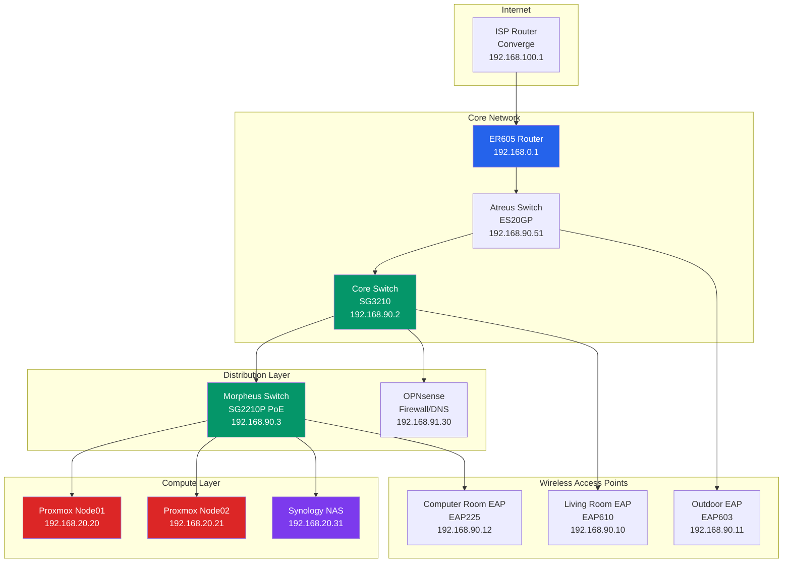

### 2.2 Omada Ecosystem

The network is managed by the TP-Link Omada Software-Defined Networking (SDN) ecosystem, providing centralized management for all network devices.

#### Network Hardware Inventory

| Device | Model | IP Address | Purpose | MAC Address |
|--------|-------|------------|---------|-------------|
| **Core Router** | ER605 v2.20 | 192.168.0.1 | Main gateway, inter-VLAN routing | 8C:90:2D:4B:D9:6C |
| **Core Switch** | SG3210 v3.20 | 192.168.90.2 | Primary L2 switch, VLAN trunking | 40:AE:30:B7:96:74 |
| **Morpheus Switch** | SG2210P v5.20 | 192.168.90.3 | Proxmox connectivity (PoE) | DC:62:79:2A:0D:66 |
| **Atreus Switch** | ES20GP v1.0 | 192.168.90.51 | First floor distribution | A8:29:48:96:C7:12 |
| **Computer Room EAP** | EAP225 v4.0 | 192.168.90.12 | WiFi AP (Computer Room) | 0C:EF:15:50:39:52 |
| **Living Room EAP** | EAP610 v3.0 | 192.168.90.10 | WiFi AP (Primary) | 3C:64:CF:37:96:EC |
| **Outdoor EAP** | EAP603-Outdoor v1.0 | 192.168.90.11 | Outdoor WiFi AP | 78:20:51:C1:EA:A6 |

#### Omada Controller

| Property | Value |
|----------|-------|
| **Platform** | TP-Link Omada Cloud Controller (OC300) |
| **Management** | Cloud-based SDN controller |
| **Access URL** | https://omada.hrmsmrflrii.xyz |

### 2.3 VLAN Architecture

The network is segmented into 8 VLANs for security, performance, and traffic isolation.

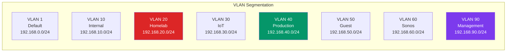

#### Complete VLAN Configuration Table

| VLAN ID | Name | Network | Gateway | Use Case | DHCP Range |
|:-------:|------|---------|---------|----------|------------|
| 1 | Default | 192.168.0.0/24 | 192.168.0.1 | Management (temporary) | .100-.199 |
| 10 | Internal | 192.168.10.0/24 | 192.168.10.1 | Main LAN (Kratos PC, Internal NAS) | .50-.254 |
| **20** | **Homelab** | **192.168.20.0/24** | **192.168.20.1** | **Proxmox Nodes, K8s, Ansible** | .50-.254 |
| 30 | IoT | 192.168.30.0/24 | 192.168.30.1 | IoT WiFi Devices | .50-.254 |
| **40** | **Production** | **192.168.40.0/24** | **192.168.40.1** | **Docker Services, Applications** | .50-.254 |
| 50 | Guest | 192.168.50.0/24 | 192.168.50.1 | Guest WiFi | .50-.254 |
| 60 | Sonos | 192.168.60.0/24 | 192.168.60.1 | Sonos Speakers (2.4GHz) | .50-.100 |
| 90 | Management | 192.168.90.0/24 | 192.168.90.1 | Network Device Management | .50-.254 |

#### Understanding VLAN Terminology

| Term | Explanation |
|------|-------------|
| **VLAN** | Virtual LAN - logically separates network traffic on the same physical switch |
| **Tagged Traffic** | Network frames that carry a VLAN ID tag (802.1Q) |
| **Untagged Traffic** | Network frames without a VLAN tag (native VLAN) |
| **Trunk Port** | Carries traffic for multiple VLANs (tagged) |
| **Access Port** | Carries traffic for only one VLAN (untagged) |
| **Native VLAN** | The VLAN used for untagged traffic on trunk ports |

### 2.4 SSID Configuration

Each VLAN has a corresponding WiFi network (SSID) for wireless access.

| SSID | VLAN | Security | Purpose |
|------|:----:|----------|---------|
| NKD5380-Internal | 10 | WPA3 | Main LAN devices |
| NHN7476-Homelab | 20 | WPA3 | Homelab wireless access |
| WOC321-IoT | 30 | WPA2 | IoT devices |
| NAZ9229-Production | 40 | WPA3 | Production services |
| EAD6167-Guest | 50 | WPA2 | Guest access |
| NAZ9229-Sonos | 60 | WPA2 | Sonos speakers |
| NCP5653-Management | 90 | WPA3 | Network management |

#### WiFi Optimization Settings

| Setting | Recommendation | Explanation |
|---------|----------------|-------------|
| **PMF** | Capable | Protected Management Frames - prevents deauth attacks |
| **802.11k** | Enabled | Radio Resource Management - helps clients find best AP |
| **MLO** | Disabled | Multi-Link Operation - breaks fast roaming (WiFi 7 only) |

### 2.5 Switch Port Configuration

#### Morpheus Switch (SG2210P) - Proxmox Connectivity

| Port | Device | Mode | Native VLAN | Tagged VLANs |
|:----:|--------|:----:|:-----------:|--------------|
| 1 | Core Switch Uplink | Trunk | 1 | All VLANs |
| 2 | **Proxmox Node 01** | Trunk | 20 | 10, 40 |
| 5 | Computer Room EAP | Trunk | 1 | All SSIDs |
| 6 | **Proxmox Node 02** | Trunk | 20 | 10, 40 |
| 7 | Synology NAS (eth0) | Access | 10 | - |
| 8 | Synology NAS (eth1) | Access | 20 | - |

#### Core Switch (SG3210) - Main Distribution

| Port | Device | Mode | Native VLAN | Tagged VLANs |
|:----:|--------|:----:|:-----------:|--------------|
| 1 | OC300 Controller | Trunk | 1 | All VLANs |
| 2 | OPNsense Port | Access | 90 | - |
| 6 | Morpheus Rack Uplink | Trunk | 1 | 10, 20, 30, 40, 50, 90 |
| 7 | Kratos PC | Trunk | 10 | 20 |
| 8 | Atreus Switch Uplink | Trunk | 1 | All VLANs |

### 2.6 DNS Configuration

DNS is handled by Pi-hole v6 with Unbound recursive resolver.

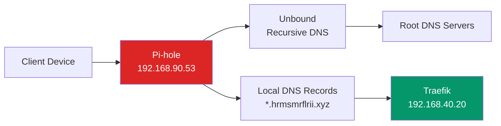

#### DNS Architecture

| Component | IP Address | Purpose |
|-----------|------------|---------|
| Pi-hole | 192.168.90.53 | DNS server, ad blocking |
| Unbound | 127.0.0.1:5335 | Recursive DNS resolver |
| OPNsense | 192.168.91.30 | Backup DNS, DHCP |

All `*.hrmsmrflrii.xyz` domains resolve to the Traefik reverse proxy at `192.168.40.20`.

### 2.7 Remote Access (Tailscale)

Tailscale provides secure remote access via WireGuard VPN without port forwarding.

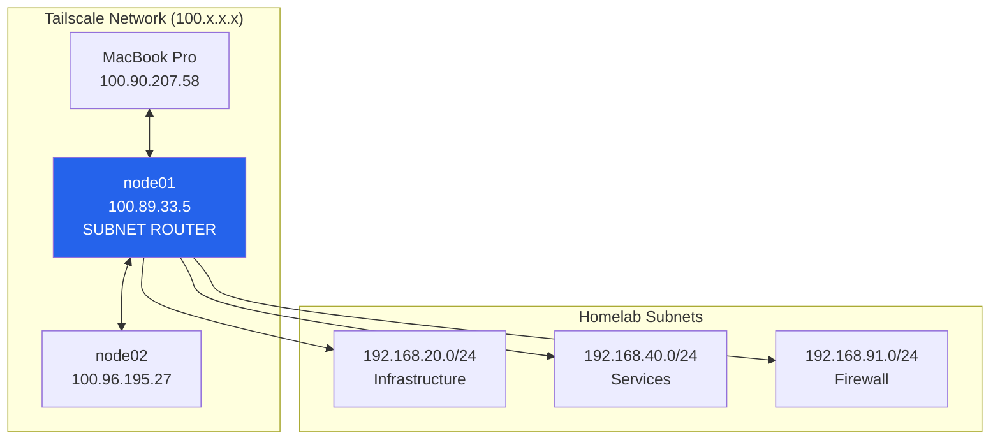

#### Tailscale IP Mapping

| Device | Local IP | Tailscale IP | Role |
|--------|----------|--------------|------|
| node01 | 192.168.20.20 | 100.89.33.5 | **Subnet Router** |
| node02 | 192.168.20.21 | 100.96.195.27 | Peer |
| MacBook Pro | - | 100.90.207.58 | Client |

**Subnet Router Configuration** (on node01):

```bash
# Advertise local subnets to Tailscale network
tailscale up --advertise-routes=192.168.20.0/24,192.168.40.0/24,192.168.91.0/24 --accept-routes
```

---

## 3. Compute Infrastructure

### 3.1 Proxmox Cluster Overview

The homelab runs on a 2-node Proxmox VE cluster with a Qdevice for quorum.

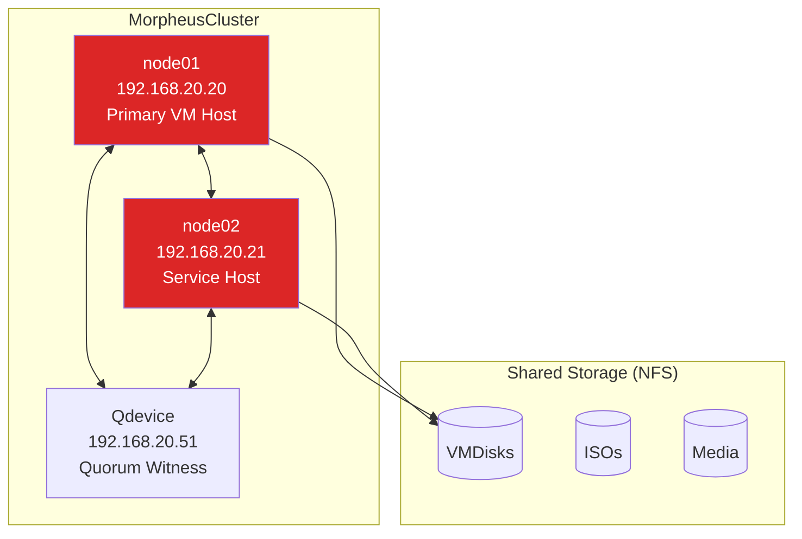

### 3.2 Node Specifications

| Property | node01 | node02 |
|----------|--------|--------|
| **IP Address** | 192.168.20.20 | 192.168.20.21 |
| **Tailscale IP** | 100.89.33.5 | 100.96.195.27 |
| **CPU** | AMD Ryzen 9 PRO 8945HS | AMD Ryzen 9 6900HX |
| **Cores** | 16 | 16 |
| **RAM** | 64 GB | 32 GB |
| **Purpose** | K8s cluster, LXCs, Core Services | Traefik, Authentik, GitLab, Immich |
| **MAC Address** | 38:05:25:32:82:76 | 84:47:09:4D:7A:CA |

### 3.3 Cluster Configuration

#### Creating the Cluster

```bash
# On node01 (Primary)
pvecm create MorpheusCluster

# On node02 (Join existing cluster)
pvecm add 192.168.20.20

# Verify cluster status
pvecm status
```

#### VLAN-Aware Bridge Configuration

**Critical**: All Proxmox nodes must have VLAN-aware bridges configured.

Edit `/etc/network/interfaces` on each node:

```bash
auto lo
iface lo inet loopback

# Physical interface
auto nic0
iface nic0 inet manual
    post-up ethtool -s nic0 wol g  # Wake-on-LAN

# VLAN-aware bridge
auto vmbr0
iface vmbr0 inet static
    address 192.168.20.XX/24   # XX = 20 for node01, 21 for node02
    gateway 192.168.20.1
    bridge-ports nic0
    bridge-stp off
    bridge-fd 0
    bridge-vlan-aware yes      # CRITICAL: Enables VLAN support
    bridge-vids 2-4094         # CRITICAL: Allowed VLAN range

source /etc/network/interfaces.d/*
```

**Line-by-Line Explanation**:

| Line | Purpose |
|------|---------|
| `auto nic0` | Automatically bring up the physical network interface at boot |
| `iface nic0 inet manual` | Configure the interface but don't assign an IP (bridge will handle it) |
| `post-up ethtool -s nic0 wol g` | Enable Wake-on-LAN after interface comes up |
| `auto vmbr0` | Automatically bring up the bridge at boot |
| `iface vmbr0 inet static` | Configure bridge with static IP |
| `bridge-ports nic0` | Connect physical NIC to the bridge |
| `bridge-stp off` | Disable Spanning Tree Protocol (not needed for single-path) |
| `bridge-fd 0` | Set forwarding delay to 0 (faster network startup) |
| `bridge-vlan-aware yes` | **Enable 802.1Q VLAN tagging support** |
| `bridge-vids 2-4094` | **Allow all VLANs (2-4094) on this bridge** |

### 3.4 VM Templates

Templates enable rapid, consistent VM deployment using cloud-init.

| Template | OS | Boot Mode | Used For |
|----------|-----|-----------|----------|
| `tpl-ubuntuv24.04-v1` | Ubuntu 24.04 | UEFI | Ansible controller |
| `tpl-ubuntu-shared-v1` | Ubuntu 22.04 | UEFI | All other VMs |

#### Creating a Cloud-Init Template

```bash
# 1. Download Ubuntu Cloud Image
cd /var/lib/vz/template/iso
wget https://cloud-images.ubuntu.com/noble/current/noble-server-cloudimg-amd64.img

# 2. Create VM
qm create 9000 --name "tpl-ubuntuv24.04-v1" --memory 2048 --cores 2 --net0 virtio,bridge=vmbr0

# 3. Import cloud image as disk
qm importdisk 9000 noble-server-cloudimg-amd64.img VMDisks

# 4. Attach the disk
qm set 9000 --scsihw virtio-scsi-single --scsi0 VMDisks:vm-9000-disk-0

# 5. Add cloud-init drive
qm set 9000 --ide2 VMDisks:cloudinit

# 6. Set boot order
qm set 9000 --boot order=scsi0

# 7. Enable UEFI boot
qm set 9000 --bios ovmf --machine q35
qm set 9000 --efidisk0 VMDisks:1,efitype=4m,pre-enrolled-keys=1

# 8. Enable QEMU guest agent
qm set 9000 --agent enabled=1

# 9. Set cloud-init defaults
qm set 9000 --ciuser hermes-admin
qm set 9000 --sshkeys ~/.ssh/authorized_keys
qm set 9000 --ipconfig0 ip=dhcp

# 10. Convert to template
qm template 9000
```

---

## 4. Storage Infrastructure

### 4.1 Synology NAS Configuration

| Property | Value |
|----------|-------|
| **Model** | DS920+ |
| **IP Address** | 192.168.20.31 |
| **DSM Version** | 7.x |
| **Total Capacity** | ~34 TB (RAID) |
| **Services** | NFS, SNMP, Plex Media Server |

#### Disk Configuration

| Slot | Drive | Model | Type | Capacity |
|:----:|-------|-------|:----:|:--------:|
| 1 | Seagate | ST8000VN004 | HDD | 8 TB |
| 2 | Seagate | ST4000VN006 | HDD | 4 TB |
| 3 | Seagate | ST12000VN0008 | HDD | 12 TB |
| 4 | Seagate | ST10000VN000 | HDD | 10 TB |
| M.2 1 | Kingston | SNV2S1000G | NVMe | 1 TB |
| M.2 2 | Crucial | CT1000P2SSD8 | NVMe | 1 TB |

### 4.2 NFS Shares

| Share Name | Export Path | Purpose | Content |
|------------|-------------|---------|---------|
| VMDisks | /volume2/ProxmoxCluster-VMDisks | VM disk images | Proxmox-managed |
| ISOs | /volume2/ProxmoxCluster-ISOs | ISO files | Proxmox-managed |
| LXC Configs | /volume2/Proxmox-LXCs | App data | Manual mount |
| Media | /volume2/Proxmox-Media | Media files | Manual mount |
| ProxmoxData | /volume2/ProxmoxData | Immich photos | Manual mount |

### 4.3 Storage Architecture

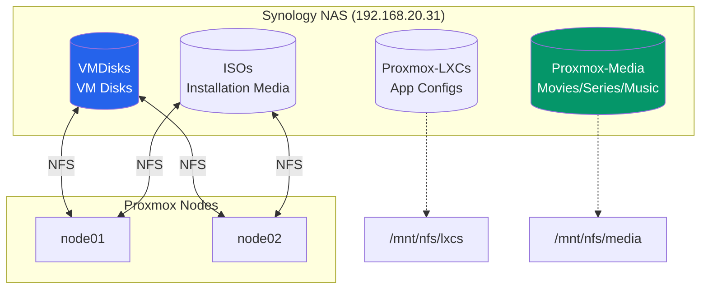

#### NFS Mount Configuration

Add to `/etc/fstab` on all Proxmox nodes:

```bash
192.168.20.31:/volume2/Proxmox-LXCs   /mnt/nfs/lxcs   nfs  defaults,_netdev  0  0
192.168.20.31:/volume2/Proxmox-Media  /mnt/nfs/media  nfs  defaults,_netdev  0  0
```

---

## 5. Docker Services

### 5.1 docker-vm-core-utilities01

**Host**: 192.168.40.13 | **Purpose**: Monitoring, utilities, custom APIs

| Service | Port | Purpose | Traefik URL |
|---------|:----:|---------|-------------|
| **Grafana** | 3030 | Metrics visualization | grafana.hrmsmrflrii.xyz |
| **Prometheus** | 9090 | Metrics collection | prometheus.hrmsmrflrii.xyz |
| **Uptime Kuma** | 3001 | Uptime monitoring | uptime.hrmsmrflrii.xyz |
| **n8n** | 5678 | Workflow automation | n8n.hrmsmrflrii.xyz |
| **Paperless-ngx** | 8000 | Document management | paperless.hrmsmrflrii.xyz |
| **Speedtest Tracker** | 3000 | Network speed monitoring | speedtest.hrmsmrflrii.xyz |
| **Karakeep** | 3005 | Bookmark manager | karakeep.hrmsmrflrii.xyz |
| **Lagident** | 9933 | Container status | lagident.hrmsmrflrii.xyz |
| **Wizarr** | 5690 | Jellyfin invite management | wizarr.hrmsmrflrii.xyz |
| **Tracearr** | 3002 | *arr stack monitoring | tracearr.hrmsmrflrii.xyz |

#### Custom APIs

| API | Port | Purpose |
|-----|:----:|---------|
| NBA Stats API | 5060 | NBA scores for Glance Sports tab |
| Media Stats API | 5054 | Media statistics for Glance |
| Life Progress API | 5051 | Life progress widget |
| Reddit Manager | 5053 | Reddit feed aggregation |

### 5.2 docker-lxc-media

**Host**: 192.168.40.11 | **Purpose**: Media services and *arr stack

| Service | Port | Purpose | Traefik URL |
|---------|:----:|---------|-------------|
| **Jellyfin** | 8096 | Media streaming | jellyfin.hrmsmrflrii.xyz |
| **Radarr** | 7878 | Movie management | radarr.hrmsmrflrii.xyz |
| **Sonarr** | 8989 | TV show management | sonarr.hrmsmrflrii.xyz |
| **Lidarr** | 8686 | Music management | lidarr.hrmsmrflrii.xyz |
| **Prowlarr** | 9696 | Indexer management | prowlarr.hrmsmrflrii.xyz |
| **Bazarr** | 6767 | Subtitle management | bazarr.hrmsmrflrii.xyz |
| **Overseerr** | 5055 | Media requests | overseerr.hrmsmrflrii.xyz |
| **Jellyseerr** | 5056 | Jellyfin requests | jellyseerr.hrmsmrflrii.xyz |
| **Tdarr** | 8265 | Media transcoding | tdarr.hrmsmrflrii.xyz |
| **SABnzbd** | 8081 | Usenet downloader | sabnzbd.hrmsmrflrii.xyz |
| **Deluge** | 8112 | Torrent client | deluge.hrmsmrflrii.xyz |

### 5.3 Service Templates

#### Standard Docker Compose Template

```yaml
# docker-compose.yml
# Service: <SERVICE_NAME>
# Host: <HOST_IP>
# Purpose: <DESCRIPTION>

services:
  <service_name>:
    image: <image>:<tag>
    container_name: <service_name>
    restart: unless-stopped
    ports:
      - "<host_port>:<container_port>"
    volumes:
      - ./config:/config           # Configuration files
      - /mnt/media:/media:ro      # Media (read-only if applicable)
    environment:
      - TZ=Asia/Manila             # Timezone
      - PUID=1000                   # User ID
      - PGID=1000                   # Group ID
    healthcheck:
      test: ["CMD", "curl", "-f", "http://localhost:<port>/health"]
      interval: 30s
      timeout: 10s
      retries: 3
    labels:
      - "traefik.enable=true"
      - "traefik.http.routers.<service>.rule=Host(`<service>.hrmsmrflrii.xyz`)"
      - "traefik.http.routers.<service>.entrypoints=websecure"
      - "traefik.http.routers.<service>.tls.certresolver=letsencrypt"
      - "traefik.http.services.<service>.loadbalancer.server.port=<port>"
```

---

## 6. Infrastructure as Code

### 6.1 Terraform Overview

Terraform deploys and manages all VMs and LXC containers on Proxmox.

#### Repository Structure

```
tf-proxmox/
├── main.tf                 # VM group definitions
├── lxc.tf                  # LXC container definitions
├── variables.tf            # Global variables
├── outputs.tf              # Output definitions
├── terraform.tfvars        # Secrets (gitignored)
└── modules/
    ├── linux-vm/           # VM deployment module
    └── lxc/                # LXC deployment module
```

#### Adding a New VM

Edit `main.tf` and add to `vm_groups`:

```hcl
new-service = {
  count         = 1
  starting_ip   = "192.168.40.50"
  starting_node = "node01"
  template      = "tpl-ubuntu-shared-v1"
  cores         = 4
  sockets       = 1
  memory        = 8192
  disk_size     = "20G"
  storage       = "VMDisks"
  vlan_tag      = 40              # VLAN 40 for services
  gateway       = "192.168.40.1"
  nameserver    = "192.168.90.53"
}
```

**Parameter Explanation**:

| Parameter | Description | Example |
|-----------|-------------|---------|
| `count` | Number of VMs to create | `1` |
| `starting_ip` | First IP address | `192.168.40.50` |
| `starting_node` | Proxmox node to deploy on | `node01` |
| `template` | Cloud-init template name | `tpl-ubuntu-shared-v1` |
| `cores` | CPU cores per VM | `4` |
| `memory` | RAM in MB | `8192` (8GB) |
| `disk_size` | Root disk size | `20G` |
| `vlan_tag` | VLAN ID (null for native) | `40` |
| `gateway` | Default gateway | `192.168.40.1` |
| `nameserver` | DNS server | `192.168.90.53` |

### 6.2 Ansible Automation

Ansible manages post-deployment configuration from the ansible-controller01 VM.

#### Inventory Structure

```ini
# inventory.ini
[all:vars]
ansible_user=hermes-admin
ansible_ssh_common_args='-o StrictHostKeyChecking=accept-new'

[k8s_controllers]
k8s-controller01 ansible_host=192.168.20.32
k8s-controller02 ansible_host=192.168.20.33
k8s-controller03 ansible_host=192.168.20.34

[k8s_workers]
k8s-worker01 ansible_host=192.168.20.40
k8s-worker02 ansible_host=192.168.20.41
k8s-worker03 ansible_host=192.168.20.42
k8s-worker04 ansible_host=192.168.20.43
k8s-worker05 ansible_host=192.168.20.44
k8s-worker06 ansible_host=192.168.20.45

[docker_hosts:children]
docker_utilities
docker_media

[docker_utilities]
docker-vm-core-utilities01 ansible_host=192.168.40.13

[docker_media]
docker-vm-media01 ansible_host=192.168.40.11
```

### 6.3 Deployment Workflows

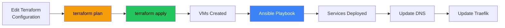

---

## 7. Azure Hybrid Environment

### 7.1 Architecture Overview

The Azure Hybrid Lab extends the homelab into Azure with a complete Active Directory environment.

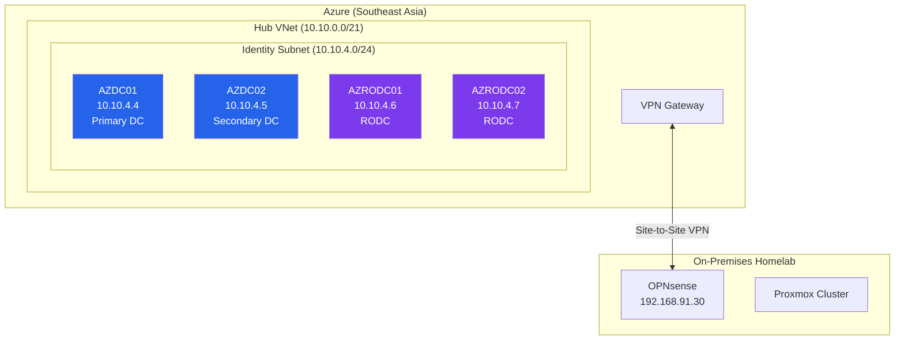

### 7.2 Active Directory Deployment

| Server | IP Address | Role | Status |
|--------|------------|------|--------|
| **AZDC01** | 10.10.4.4 | Primary DC (Forest Root) | Running |
| **AZDC02** | 10.10.4.5 | Secondary DC | Running |
| **AZRODC01** | 10.10.4.6 | Read-Only DC | Running |
| **AZRODC02** | 10.10.4.7 | Read-Only DC | Running |

**Domain Details**:

| Property | Value |
|----------|-------|
| **Domain** | hrmsmrflrii.xyz |
| **NetBIOS** | HRMSMRFLRII |
| **Forest Level** | Windows Server 2016 |

### 7.3 Enterprise Tiering Model

The AD structure follows Microsoft's privileged access tiering model.

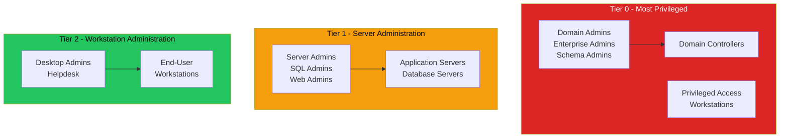

#### OU Structure

```
DC=hrmsmrflrii,DC=xyz
├── OU=Tier 0
│   ├── OU=Admin Accounts
│   ├── OU=Admin Groups
│   ├── OU=Admin Workstations
│   └── OU=Servers (Domain Controllers)
├── OU=Tier 1
│   ├── OU=Admin Accounts
│   ├── OU=Service Accounts
│   └── OU=Servers
│       ├── OU=Application Servers
│       ├── OU=Database Servers
│       └── OU=Web Servers
├── OU=Tier 2
│   ├── OU=Admin Accounts
│   └── OU=Workstations
└── OU=Corporate
    ├── OU=Users
    ├── OU=Groups
    └── OU=Departments
```

---

## 8. Observability Stack

### 8.1 Glance Dashboard

Glance provides a unified dashboard for all homelab services.

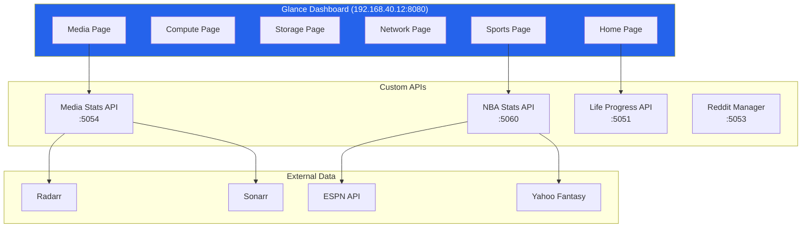

#### Dashboard Tabs

| Tab | Content | Protected |
|-----|---------|:---------:|
| **Home** | Service monitors, bookmarks, markets, life progress | Yes |
| **Compute** | Proxmox cluster + Container monitoring (Grafana) | Yes |
| **Storage** | Synology NAS dashboard (Grafana) | Yes |
| **Network** | Omada network overview + Speedtest | Yes |
| **Media** | Media stats grid, downloads, queue | Yes |
| **Sports** | NBA games, standings, Yahoo Fantasy | Yes |

### 8.2 Prometheus & Grafana

#### Prometheus Scrape Targets

| Job Name | Target | Metrics |
|----------|--------|---------|
| proxmox | 192.168.20.20:9221, 192.168.20.21:9221 | PVE metrics |
| docker-stats-utilities | 192.168.40.13:9417 | Container metrics |
| docker-stats-media | 192.168.40.11:9417 | Container metrics |
| synology | 192.168.20.31 (SNMP) | NAS metrics |
| omada | 192.168.0.103 | Network metrics |
| opnsense | 192.168.91.30:9198 | Firewall metrics |

#### Grafana Dashboards

| Dashboard | UID | Purpose | Iframe Height |
|-----------|-----|---------|:-------------:|
| Proxmox Cluster | proxmox-compute | Node and VM stats | 1100px |
| Container Status | container-status | Docker container health | 1500px |
| Synology NAS | synology-nas-modern | Storage metrics | 1350px |
| Omada Network | omada-network | Network overview | 2200px |

### 8.3 Custom APIs

#### Media Stats API

Aggregates Radarr and Sonarr data for the Glance Media page.

**Endpoint**: `http://192.168.40.12:5054/api/stats`

**Response Format**:
```json
{
  "stats": [
    {"label": "WANTED MOVIES", "value": 15, "color": "#f59e0b"},
    {"label": "MOVIES DOWNLOADING", "value": 3, "color": "#3b82f6"},
    {"label": "MOVIES DOWNLOADED", "value": 847, "color": "#22c55e"},
    {"label": "WANTED EPISODES", "value": 1906, "color": "#ef4444"},
    {"label": "EPISODES DOWNLOADING", "value": 12, "color": "#8b5cf6"},
    {"label": "EPISODES DOWNLOADED", "value": 5432, "color": "#06b6d4"}
  ]
}
```

---

## 9. Security Architecture

### 9.1 Authentik SSO

Authentik provides Single Sign-On (SSO) for all services.

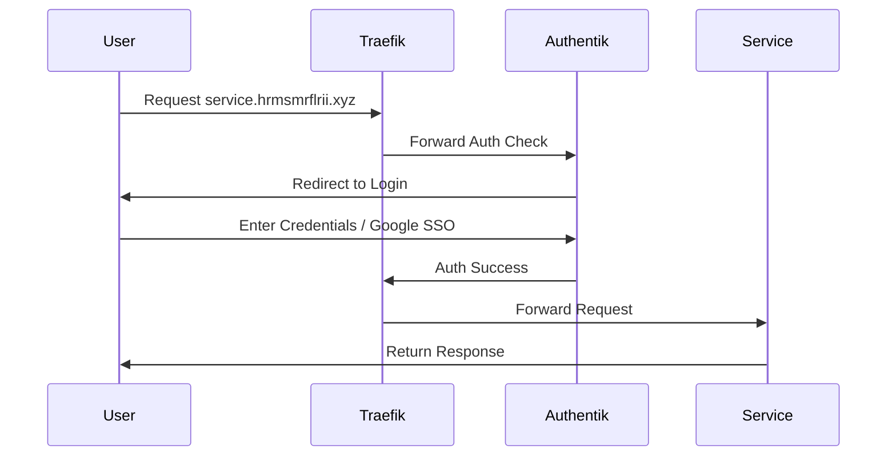

### 9.2 Forward Authentication

Services are protected using Traefik's ForwardAuth middleware.

#### Adding Forward Auth to a Service

**Step 1**: Add provider and application in Authentik blueprint:

```yaml
# /opt/authentik/blueprints/custom/forward-auth-services.yaml
- model: authentik_providers_proxy.proxyprovider
  id: myservice-provider
  identifiers:
    name: myservice-provider
  attrs:
    name: myservice-provider
    mode: forward_single
    external_host: https://myservice.hrmsmrflrii.xyz

- model: authentik_core.application
  id: myservice-app
  identifiers:
    slug: myservice
  attrs:
    name: My Service
    slug: myservice
    provider: !Find [authentik_providers_proxy.proxyprovider, [name, myservice-provider]]
```

**Step 2**: Add middleware to Traefik route:

```yaml
# /opt/traefik/config/dynamic/services.yml
http:
  routers:
    myservice:
      rule: "Host(`myservice.hrmsmrflrii.xyz`)"
      service: myservice
      entryPoints:
        - websecure
      middlewares:
        - authentik-auth    # Forward Auth middleware
      tls:
        certResolver: letsencrypt
```

### 9.3 SSL/TLS Configuration

All services use Let's Encrypt certificates via Cloudflare DNS-01 challenge.

| Component | Configuration |
|-----------|---------------|
| **Certificate Provider** | Let's Encrypt |
| **Challenge Type** | DNS-01 (Cloudflare) |
| **Certificate Type** | Wildcard (*.hrmsmrflrii.xyz) |
| **Storage** | /opt/traefik/certs/acme.json |
| **Auto-Renewal** | Yes (Traefik handles it) |

---

## 10. Backup & Disaster Recovery

### 10.1 Backup Strategy

| Data | Location | Method | Frequency |
|------|----------|--------|-----------|
| **Terraform State** | Local + Git | Version control | Every change |
| **Ansible Playbooks** | Git repo | GitHub | Every change |
| **VM Templates** | Proxmox | Snapshot/Export | Monthly |
| **Service Configs** | /opt/* on VMs | Rsync to NAS | Daily |
| **Database Backups** | Various | pg_dump | Daily |
| **Media Files** | NAS | External backup | Weekly |
| **SSL Certificates** | acme.json | Copy to backup | Weekly |
| **OPNsense Config** | OPNsense | Built-in backup | Weekly |
| **Proxmox Config** | /etc/pve | Built-in backup | Weekly |
| **Omada Config** | FTP | Auto-backup | Weekly |

### 10.2 Disaster Recovery Procedures

#### Recovery Time Estimates

| Phase | Estimated Time |
|-------|:--------------:|
| Network Infrastructure | 1-2 hours |
| Storage Infrastructure | 1-2 hours |
| Proxmox Cluster | 2-3 hours |
| VM Templates | 30 minutes |
| Terraform Deployment | 30-45 minutes |
| Ansible Configuration | 30 minutes |
| Kubernetes Cluster | 45-60 minutes |
| Docker Services | 2-3 hours |
| DNS and SSL | 30-60 minutes |
| **Total Estimated** | **8-12 hours** |

#### Quick Recovery Commands

```bash
# Backup Proxmox VM
vzdump 100 --storage VMDisks --mode snapshot

# Backup service configs
rsync -avz hermes-admin@192.168.40.13:/opt/ /backup/docker-utilities/

# Restore Terraform state
terraform init
terraform plan -out=recovery.tfplan
terraform apply recovery.tfplan
```

---

## 11. Future Enhancements

### Planned Improvements

| Category | Enhancement | Priority |
|----------|-------------|:--------:|
| **Network** | OPNsense as primary gateway/firewall | High |
| **Security** | Implement Crowdsec IDS/IPS | High |
| **Storage** | Add 3-2-1 backup strategy | High |
| **Compute** | Add third Proxmox node | Medium |
| **Monitoring** | Implement AlertManager | Medium |
| **Kubernetes** | Deploy ArgoCD for GitOps | Medium |
| **Azure** | Integrate with Azure Monitor | Low |
| **Automation** | Implement CI/CD for IaC | Medium |

### Roadmap

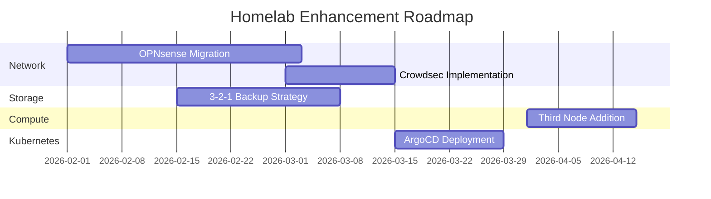

---

## 12. Appendix

### A. IP Address Quick Reference

#### VLAN 20 - Infrastructure

| IP | Hostname | Purpose |
|----|----------|---------|
| 192.168.20.20 | node01 | Proxmox Primary |
| 192.168.20.21 | node02 | Proxmox Secondary |
| 192.168.20.30 | ansible | Ansible Controller |
| 192.168.20.31 | nas | Synology NAS |
| 192.168.20.32-34 | k8s-controller* | K8s Control Plane |
| 192.168.20.40-45 | k8s-worker* | K8s Workers |

#### VLAN 40 - Services

| IP | Hostname | Purpose |
|----|----------|---------|
| 192.168.40.11 | docker-media | Arr stack, Jellyfin |
| 192.168.40.12 | docker-glance | Glance, APIs |
| 192.168.40.13 | docker-utilities | Monitoring, utilities |
| 192.168.40.20 | traefik | Reverse Proxy |
| 192.168.40.21 | authentik | SSO |
| 192.168.40.22 | immich | Photo management |
| 192.168.40.23 | gitlab | DevOps platform |
| 192.168.40.25 | homeassistant | Smart home |

### B. Service URLs

| Service | Internal URL | External URL |
|---------|--------------|--------------|
| Proxmox | https://192.168.20.21:8006 | https://proxmox.hrmsmrflrii.xyz |
| Traefik | http://192.168.40.20:8080 | https://traefik.hrmsmrflrii.xyz |
| Authentik | http://192.168.40.21:9000 | https://auth.hrmsmrflrii.xyz |
| Glance | http://192.168.40.12:8080 | https://glance.hrmsmrflrii.xyz |
| Grafana | http://192.168.40.13:3030 | https://grafana.hrmsmrflrii.xyz |
| Jellyfin | http://192.168.40.11:8096 | https://jellyfin.hrmsmrflrii.xyz |

### C. Command Cheatsheet

```bash
# Proxmox
pvecm status              # Cluster status
qm list                   # List VMs
pct list                  # List containers

# Terraform
terraform plan            # Preview changes
terraform apply           # Apply changes
terraform state list      # List resources

# Ansible
ansible all -m ping       # Test connectivity
ansible-playbook *.yml    # Run playbook

# Docker
docker ps                 # List containers
docker compose logs -f    # Follow logs
docker compose restart    # Restart services

# Kubernetes
kubectl get nodes         # List nodes
kubectl get pods -A       # All pods
kubectl describe pod X    # Pod details
```

---

**Document Information**

| Property | Value |
|----------|-------|
| Author | Hermes Miraflor II |
| Version | 1.0 |
| Created | January 7, 2026 |
| Last Updated | January 7, 2026 |
| Repository | https://github.com/herms14/Proxmox-TerraformDeployments |

---

*This manual is a living document and will be updated as the infrastructure evolves.*
