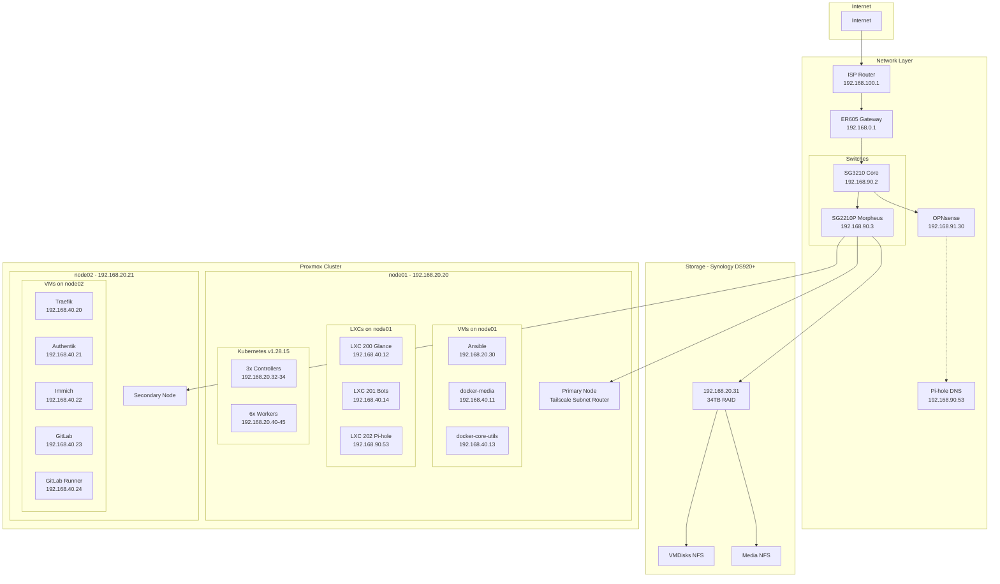
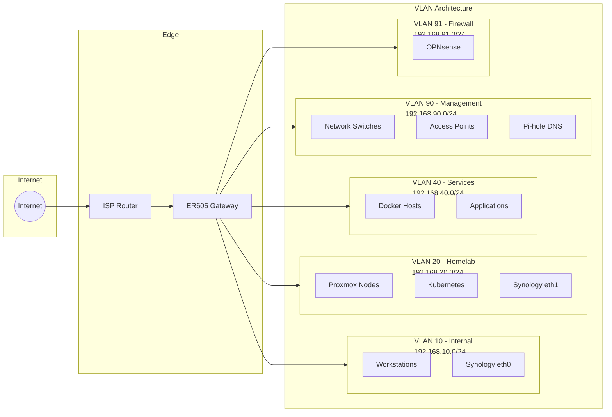
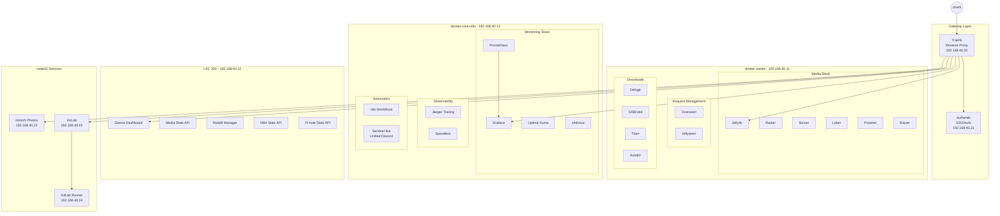
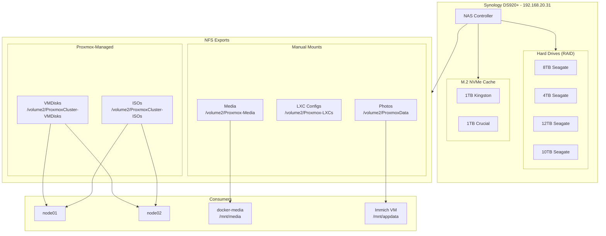
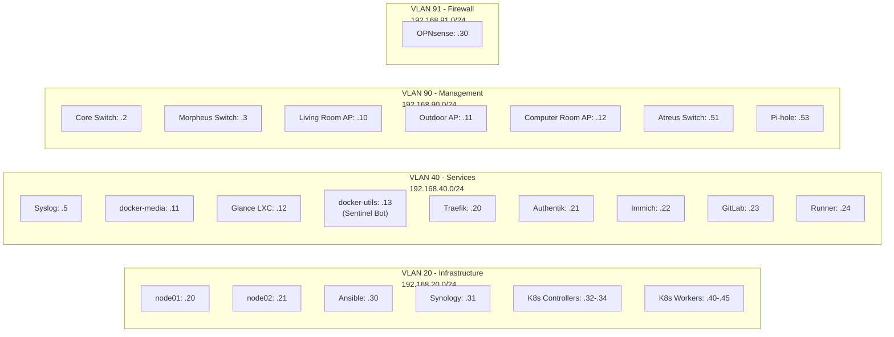
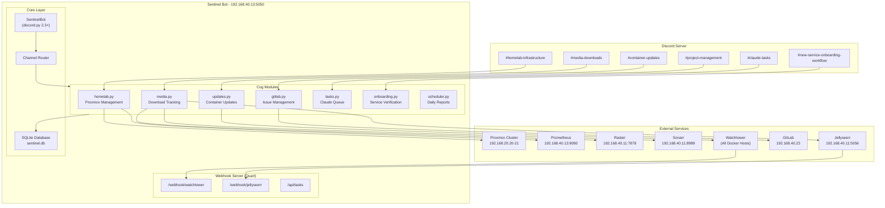
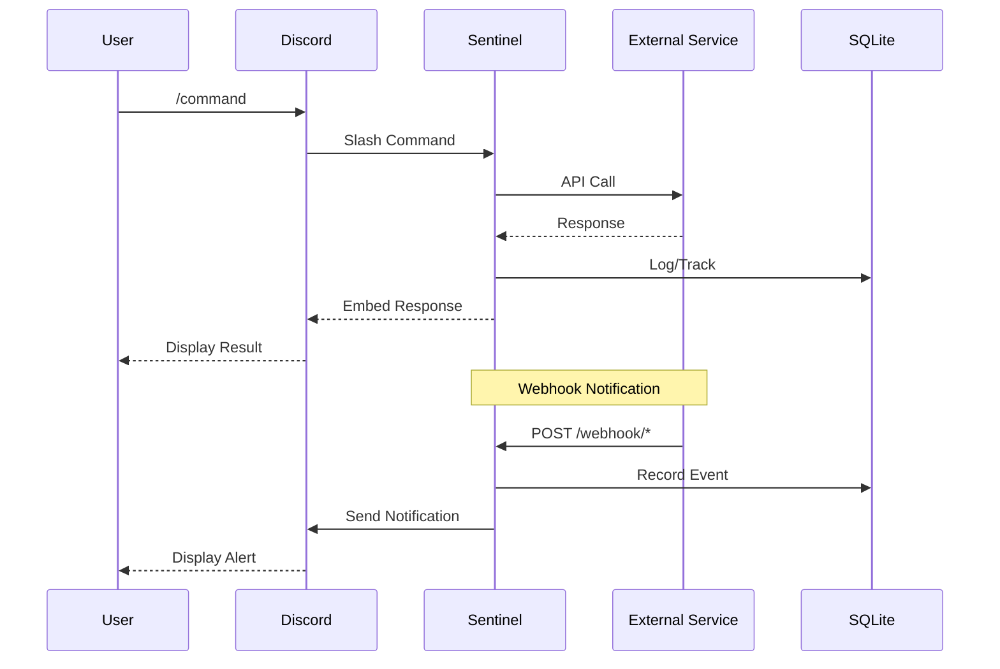

# Homelab Architecture Diagrams

This directory contains architecture diagrams for the homelab infrastructure.

## Generated Diagrams (PNG)

These diagrams are auto-generated using the Python `diagrams` library:

| Diagram | Description |
|---------|-------------|
|  | Complete infrastructure overview |
|  | Application services and their relationships |
|  | Network topology and VLAN architecture |

**Generator Script:** `scripts/generate-infrastructure-diagram.py`

**Requirements:**
- Python 3.x
- `diagrams` library (`pip install diagrams`)
- `graphviz` system package

**To regenerate:**
```bash
ssh ansible
cd ~/diagrams
python3 generate-infrastructure-diagram.py
```

---

## Mermaid Diagrams

The following Mermaid diagrams render in Obsidian, GitHub, and most Markdown viewers.

## Complete Infrastructure Overview



## Network Topology (VLANs)



## Services Architecture



## Storage Architecture



## IP Address Map



---

## Sentinel Bot Architecture



### Sentinel Bot Data Flow



---

## How to Generate PNG Diagrams

### Using Python `diagrams` library:

```bash
# Install dependencies
pip install diagrams

# Run the generator script
cd tf-proxmox/scripts
python generate-homelab-diagrams.py
```

### Using Mermaid CLI:

```bash
# Install mermaid-cli
npm install -g @mermaid-js/mermaid-cli

# Convert this file to PNG
mmdc -i HOMELAB_ARCHITECTURE.md -o homelab_architecture.png
```

### Online Rendering:

- **GitHub**: Mermaid diagrams render automatically
- **Obsidian**: Install Mermaid plugin for live preview
- **mermaid.live**: Paste diagram code for web-based editing
