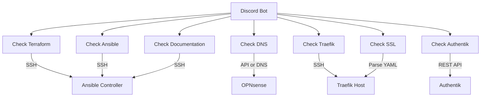

# Service Onboarding Workflow

This document explains the automated service onboarding checker and the complete workflow for deploying new services to the homelab.

## Overview

When you deploy a new service to your homelab, multiple components need to be configured:

| Component | What It Does | Why It's Needed |
|-----------|--------------|-----------------|
| Virtual Machine | The server where the service runs | Provides compute resources |
| Ansible Playbook | Instructions for setting up the service | Automates deployment |
| DNS Record | A friendly URL like `jellyfin.hrmsmrflrii.xyz` | Makes the service accessible by name |
| Traefik Route | Routes traffic from the internet to your service | Enables web access |
| SSL Certificate | Secures connections with HTTPS | Shows the padlock icon in browsers |
| Authentik SSO | Login protection (optional) | Adds security layer |
| Discord Integration | Add to bots for notifications | Update tracking |
| Documentation | Written instructions for managing the service | Future reference |

The Service Onboarding Checker automatically verifies each of these and reports status in Discord.

## Discord Bot Ecosystem

Three Discord bots manage different aspects of the homelab:

| Bot | Channel | Purpose |
|-----|---------|---------|
| **Update Manager** | #update-manager | Container updates, onboarding |
| **Argus SysAdmin** | #argus-assistant | VM/container control |
| **Download Monitor** | #media-downloads | Radarr/Sonarr notifications |

When onboarding a new service:
- **All services**: Add to Update Manager's `CONTAINER_HOSTS`
- **Media services**: Configure webhooks to Download Monitor
- **VMs**: Add to Argus bot's `VM_MAPPING`

## Discord Commands

Access these in the `new-service-onboarding-workflow` channel:

```
/onboard jellyfin     → Check specific service
/onboard-all          → Check all services
/onboard-services     → List all discovered services
```

## Reading the Status Table

```
Service         | TF  | Ans | DNS | Traf | SSL | Auth | Docs
----------------|-----|-----|-----|------|-----|------|-----
jellyfin        |  ✓  |  ✓  |  ✓  |   ✓  |  ✓  |   ✓  |   ✓
n8n             |  ✓  |  ✗  |  ✓  |   ✓  |  ✓  |   -  |   ✓
```

**Legend:**
- **TF** = Terraform VM definition
- **Ans** = Ansible playbook or reference in `~/ansible/`
- **DNS** = Domain name resolves
- **Traf** = Traefik router configured
- **SSL** = HTTPS enabled
- **Auth** = Authentik SSO (optional)
- **Docs** = Service documented

**Values:** ✓ = Configured, ✗ = Needs attention, - = Not applicable

## Daily Report

Every day at **9:00 AM Eastern**, the bot posts a summary of all services.

## CI/CD Integration

When you deploy via GitLab CI/CD, the system automatically runs an onboarding check and posts results to Discord after deployment.

## Architecture



## How Each Check Works

### Terraform Check
- **Method**: SSH to Ansible controller, search `main.tf`
- **Looks for**: VM group definition with service name
- **Location**: `~/tf-proxmox/main.tf`

### Ansible Check
- **Method**: SSH to Ansible controller, find playbook
- **Looks for**: Folder like `~/ansible-playbooks/service-name/`
- **Location**: `~/ansible-playbooks/`

### DNS Check
- **Method**: OPNsense API or DNS resolution
- **Looks for**: `servicename.hrmsmrflrii.xyz` resolving correctly
- **Fallback**: Standard DNS lookup if no API credentials

### Traefik Check
- **Method**: SSH to Traefik host, parse YAML config
- **Looks for**: Router definition for the service
- **Location**: `/opt/traefik/config/dynamic/services.yml`

### SSL Check
- **Method**: Parse Traefik config for TLS settings
- **Looks for**: `tls.certResolver: letsencrypt`
- **Location**: Same as Traefik

### Authentik Check
- **Method**: REST API call to Authentik
- **Looks for**: Application with matching slug
- **Endpoint**: `http://192.168.40.21:9000/api/v3/core/applications/`

### Documentation Check
- **Method**: SSH to Ansible controller, search docs
- **Looks for**: Service name in `docs/SERVICES.md`
- **Location**: `~/tf-proxmox/docs/SERVICES.md`

## Configuration

### Environment Variables

| Variable | Purpose |
|----------|---------|
| `DISCORD_TOKEN` | Bot authentication |
| `DISCORD_CHANNEL_ID` | Updates channel |
| `ONBOARD_CHANNEL_ID` | Onboarding channel (`1452141884809154581`) |
| `OPNSENSE_API_KEY` | DNS API access (optional) |
| `OPNSENSE_API_SECRET` | DNS API secret (optional) |
| `AUTHENTIK_TOKEN` | SSO API access (optional) |

### Adding Credentials

```bash
ssh hermes-admin@192.168.40.13
sudo nano /opt/update-manager/.env

# Add:
OPNSENSE_API_KEY=your_key
OPNSENSE_API_SECRET=your_secret
AUTHENTIK_TOKEN=your_token

# Restart:
cd /opt/update-manager && sudo docker compose restart
```

### Getting API Credentials

**OPNsense:**
1. System > Access > Users
2. Edit user > + Add API Key
3. Save key and secret

**Authentik:**
1. Directory > Tokens and App passwords
2. Create > API Token
3. Copy token value

## Troubleshooting

### Bot Not Responding
```bash
# Check container
ssh hermes-admin@192.168.40.13 "docker ps | grep update-manager"

# Check logs
ssh hermes-admin@192.168.40.13 "docker logs update-manager --tail 50"

# Test health
ssh hermes-admin@192.168.40.13 "curl http://localhost:5050/health"
```

### Commands Not Showing
- Slash commands can take up to 1 hour to sync
- Check logs for "Slash commands synced"
- Restart container if needed

### Wrong Check Status
1. **Terraform**: Verify service name in `main.tf`
2. **Ansible**: Ensure playbook folder exists
3. **DNS**: Test with `nslookup servicename.hrmsmrflrii.xyz`
4. **Traefik**: Check router name in `services.yml`
5. **Authentik**: Confirm application slug matches

## Files and Locations

| Component | Host | Path |
|-----------|------|------|
| Update Manager | docker-vm-core-utilities01 | `/opt/update-manager/` |
| Argus SysAdmin Bot | docker-vm-core-utilities01 | `/opt/sysadmin-bot/` |
| Download Monitor | docker-vm-media01 | `/opt/download-monitor/` |
| Docker Compose | varies | `/opt/<service>/docker-compose.yml` |
| Environment | docker-vm-core-utilities01 | `/opt/update-manager/.env` |
| CI/CD Script | gitlab-runner-vm01 | `/opt/gitlab-runner/scripts/notify_discord.py` |
| Traefik Config | traefik-vm01 | `/opt/traefik/config/dynamic/services.yml` |

## Complete Onboarding Checklist

### Infrastructure
- [ ] Add VM definition to `main.tf` (if new VM needed)
- [ ] Run `terraform apply`
- [ ] Create Ansible playbook in `ansible-playbooks/`

### Routing & Security
- [ ] Add Traefik route to `/opt/traefik/config/dynamic/services.yml`
- [ ] Add DNS entry in OPNsense
- [ ] Create Authentik provider + application (if SSO protected)
- [ ] Assign provider to Embedded Outpost

### Discord Integration
- [ ] Add container to `CONTAINER_HOSTS` in Update Manager
- [ ] Add VM to `VM_MAPPING` in Argus bot (if applicable)
- [ ] Configure webhooks to Download Monitor (for media services)

### Documentation
- [ ] Update `docs/SERVICES.md`
- [ ] Update wiki page
- [ ] Update Obsidian vault

### Verification
- [ ] Run `/onboard <service>` to verify checks
- [ ] Test URL: `https://<service>.hrmsmrflrii.xyz`
- [ ] Verify SSO works (if applicable)

## Related Pages
- [[20 - GitLab CI-CD Automation]]
- [[19 - Watchtower Updates]]
- [[07 - Deployed Services]]
- [[06 - Ansible Automation]]
